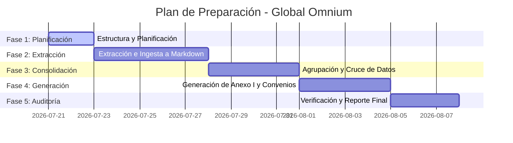

# ROADMAP.md - Ruta de Trabajo de Global Omnium 🛣️📈

Este documento define la planificación estratégica y las fases de desarrollo para la preparación de los 349 expedientes de la campaña de sustitución de flota corporativa del grupo **Global Omnium**.

---

## 📅 Planificación de Fases

---

## 🔍 Detalle de las Fases

### 🏛️ Fase 1: Planificación y Estructura (Fase Actual) ⏳
* **Objetivo:** Sentar las bases del proyecto, crear la estructura de directorios y redactar los requisitos del lote.
* **Tareas Clave:**
  * Crear la estructura de directorios bajo `resultados_creacion/global_omnium/`.
  * Definir la lista de filiales, NIFs y representantes legales en `requisitos_campana.md`.
  * Desarrollar un script inicial para analizar el Excel central e inventariar la correspondencia de archivos de Altas y Bajas.

### 📄 Fase 2: Extracción e Ingesta de Datos (Caché Local) ⏳
* **Objetivo:** Digitalizar y pasar a texto legible los documentos de soporte de Altas (facturas nuevas) y Bajas (contratos, entregas y devoluciones de renting) utilizando el pipeline de parsing de `parser.py`.
* **Tareas Clave:**
  * Correr extracción con `liteparse` para documentos digitales.
  * Forzar OCR local para PDFs escaneados y actas de devolución/entrega.
  * Escribir la caché de texto en `03_cache_markdown/[MatriculaNueva]/` para lograr ejecuciones a coste cero.

### ⚙️ Fase 3: Consolidación y Cruce de Datos ⏳
* **Objetivo:** Agrupar las actuaciones por Sociedad filial, Comunidad Autónoma y Año de adquisición, e integrar los datos de representación legal.
* **Tareas Clave:**
  * Desarrollar lógica de agrupación en lote.
  * Realizar validaciones de consistencia de bastidor/matrícula empleando `rules.py`.
  * Cruzar los datos del Excel con la información de los poderes de representación de cada filial.

### 🚗 Fase 4: Generación de Documentación Oficial ⏳
* **Objetivo:** Generar todos los formularios PDF oficiales listos para firma y preparar la documentación adjunta formateada.
* **Tareas Clave:**
  * Rellenar el formulario oficial del Anexo I para cada uno de los 349 registros (inyectando la referencia catastral).
  * Autogenerar el documento del Convenio de Cesión para cada grupo consolidado (con la tabla de vehículos y ahorros en kWh).
  * Generar la Ficha CAE de cálculo final.
  * Copiar y renombrar todos los justificantes originales (Facturas, Fichas Técnicas, Actas) en la carpeta de salida `04_preparados_verificar/[ID_CAE]/` siguiendo el formato oficial de verificación.

### 📊 Fase 5: Auditoría de Control y Reporte Final ⏳
* **Objetivo:** Validar la conformidad absoluta de los expedientes generados antes de su presentación oficial.
* **Tareas Clave:**
  * Ejecutar el auditor de consistencia cruzada de `main.py` sobre los expedientes preparados.
  * Corregir posibles discrepancias de extracción o datos omitidos.
  * Generar el informe de ahorros consolidados de Global Omnium en `05_reportes/informe_consolidado_ahorros.md`.
