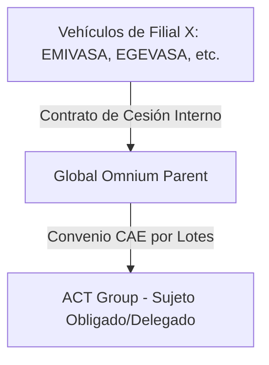

# Requisitos de la Campaña - Proyecto Global Omnium 📋🛡️

Este documento recopila el contexto del cliente, la estructura de la campaña, la cadena de trazabilidad de los ahorros energéticos y las condiciones de validación para los expedientes del lote corporativo **Global Omnium** bajo la ficha **TRA050 v1.1**.

---

## 🏛️ 1. Contexto de Global Omnium y Estructura del Grupo

**Global Omnium** es un grupo empresarial líder en la gestión y tratamiento del ciclo completo del agua. Su actividad principal abarca:
* **Extracción de recursos hídricos** (pozos, captaciones, acuíferos).
* **Producción y potabilización de agua** (plantas de tratamiento ETAP, desoladoras).
* **Distribución y saneamiento** (mantenimiento y explotación de redes de distribución urbana y depuración EDAR).

### Estructura de Sociedades (Filiales)
Debido a la naturaleza descentralizada de los servicios públicos municipales y las concesiones locales, el grupo se divide en una gran cantidad de filiales, empresas mixtas y Uniones Temporales de Empresas (UTEs). Cada una gestiona activos y flotas de vehículos de forma independiente.

Las principales sociedades y filiales identificadas en el inventario son:
* **AGUAS DE VALENCIA SA** (AVSA)
* **EMPRESA MIXTA VALENCIANA DE AGUAS SA** (EMIVASA)
* **EGEVASA** (Diputación de Valencia)
* **E.Mixta Metropolitana, SA** (Depuración de Valencia)
* **GAMASER** (Laboratorio y control de calidad)
* **CGAC** (Cataluña)
* **ARAGONESA SER.PUBLICOS SL** (Aragón)
* **EMPRESA MIXTA CALPE** / **MORELLA** / **AIGÜES DE SAGUNT, S.A.** (Concesiones locales)
* **FUCSA** / **SASTESA** / **CANALIZ. CIVILES S.A.** (Obra y mantenimiento de redes)
* **UTEs de Explotación** (ej: UTE EDAR TABLADA, UTE CHIVA, UTE CAMPO CARTAGENA, UTE SOFTCAD-VANAGUA)

---

## 🔄 2. Procedimiento de Centralización de Ahorros (Cadena de Custodia)

A pesar de que los vehículos nuevos y antiguos pertenecen a múltiples filiales (Empresa X), a efectos de la emisión de Certificados de Ahorro Energético (CAE) se ha definido un **procedimiento de centralización a través de Global Omnium**.

Para garantizar la validez legal ante el verificador acreditado y evitar la fragmentación en cientos de convenios, la cesión de ahorros se estructurará en dos niveles:

1. **Contrato de Cesión Interno (Nivel 1):**
   * Un contrato de cesión de ahorros energéticos entre la **Filial X** (como Cedente original del ahorro) y **Global Omnium** (como Cesionario y centralizador).
   * Este contrato justifica que Global Omnium adquiere legalmente los derechos sobre los kWh acumulados por la flota de esa filial.
2. **Convenio CAE Final (Nivel 2):**
   * Convenio de cesión de ahorros final entre **Global Omnium** (como Cedente centralizador) y **ACT Group** (como Sujeto Obligado/Delegado que tramita los CAEs).
3. **Estrategia de Lotes:**
   * La firma de los Convenios CAE finales de Global Omnium con ACT Group se organizará **por lotes consolidados** (por ejemplo, agrupando las actuaciones por año de compra de vehículo nuevo y Comunidad Autónoma de la actuación) para simplificar la firma digital final por parte de los representantes autorizados.

---

## 📄 3. Requisitos Documentales y Renting

Dado que la mayor parte de la flota de Global Omnium está gestionada a través de contratos de renting corporativos con financieras, aplicamos la actualización del criterio del organismo rector:

### A. Justificantes del Vehículo Nuevo (Alta):
1. **Factura de Adquisición/Renting:** Factura emitida por el concesionario o la empresa de renting. Debe incluir la matrícula, marca, modelo y número de bastidor (VIN).
2. **Permiso de Circulación Nuevo:** Matriculado a nombre de la empresa de renting o de la filial (en el primer caso, acompañado del contrato de renting correspondiente).
3. **Ficha Técnica (eITV):** Certificado con el consumo homologado $CVN$ (en kWh/100km).

### B. Justificantes del Vehículo Antiguo (Baja):
1. **Ficha Técnica Antigua:** ITV del vehículo de combustión viejo para catalogación y consumos.
2. **Justificante de Posesión Antigua (Umbrales de Duración):**
   * **Caso Propiedad (1 Año):** Si el coche era propiedad de la filial, Permiso de Circulación antiguo o recibo del IVTM que demuestre la titularidad de la filial durante al menos **1 año (365 días)**.
   * **Caso Renting (2 Años - Criterio Oficial):** Si el coche sustituido estaba en régimen de renting, es obligatorio demostrar una posesión mínima de **2 años (730 días)** entregando en lugar del justificante de propiedad:
     * a) Contrato de la operación de renting en el que figure la filial solicitante como arrendataria/usuario.
     * b) Acta de entrega del vehículo firmada en conformidad entre el arrendador y el arrendatario/usuario.
3. **Acreditación de la Baja / Pérdida de Posesión:**
   * **Caso Propiedad:** Certificado de destrucción o solicitud de cambio de titularidad en DGT.
   * **Caso Renting:** Acta de devolución del vehículo antiguo al proveedor de renting, acreditando su entrega física y la finalización de su uso.

---

## ⚙️ 4. Reglas de Validación y Consistencia del Código

El motor de reglas de [rules.py](file:///home/msimarro/03_code/tra050/src/tra050_auditor/rules.py) comprobará:

* **Posesión Dinámica:** 
  * Si `es_renting` = `True` $\rightarrow$ Validar posesión $\ge$ 730 días.
  * Si `es_renting` = `False` $\rightarrow$ Validar propiedad $\ge$ 365 días.
* **Trazabilidad de la Cesión:**
  * Verificar la presencia física de ambos contratos de cesión (Contrato Interno Filial $\rightarrow$ Global Omnium y Convenio CAE Colectivo Global Omnium $\rightarrow$ ACT Group).
* **Consistencia de NIF y Nombres:**
  * El NIF y nombre en las facturas de alta y contratos de renting debe coincidir con la Filial X correspondiente.
